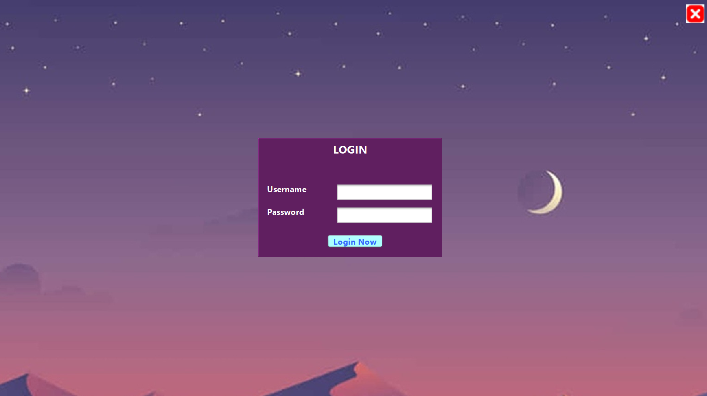
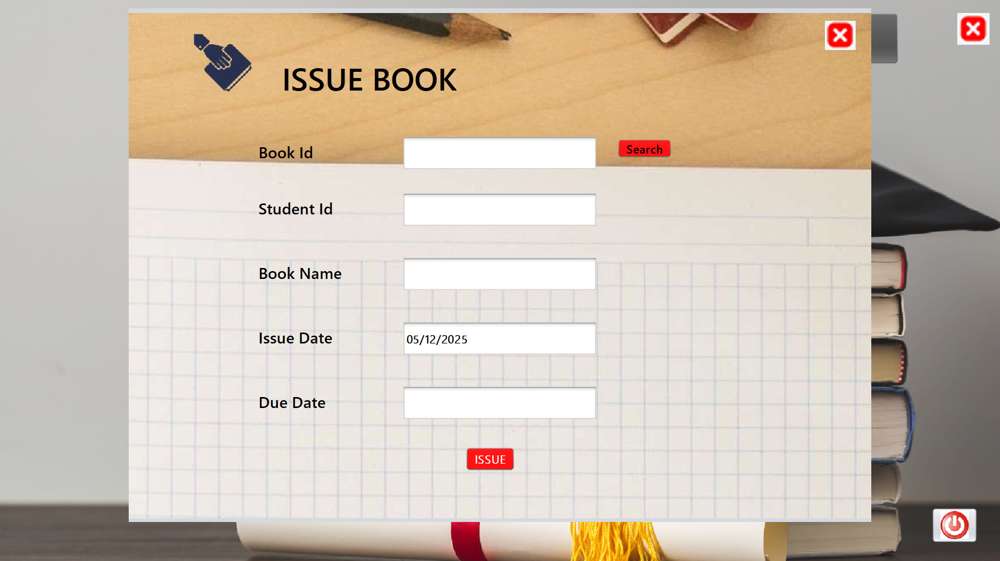
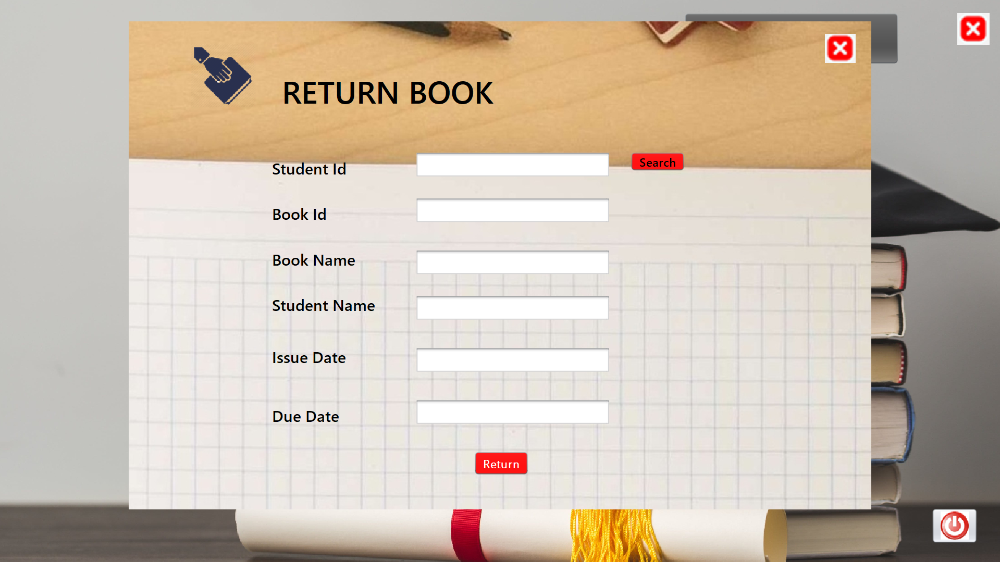

# Library-Management-System-App

A complete Library Management System built using Java Swing, NetBeans GUI Builder, and MySQL Database.

This desktop application allows you to manage books, students, issue/return operations, and login authentication.

---

## ✨ Features

🔐 User Login
🏠 Home Dashboard
📘 Add Books
🎓 Student Registration
🔄 Issue Books
📥 Return Books
🚀 Loading Screens (L1 & L2)
🔌 MySQL Database Connectivity

---

## 🗄 Database Setup

### Create Database

```bash
CREATE DATABASE library;
USE library;
```

### Create Tables

```bash
-- LOGIN TABLE
CREATE TABLE login (
    userid VARCHAR(50),
    password VARCHAR(50)
);

-- STUDENT TABLE
CREATE TABLE student (
    id INT PRIMARY KEY,
    name VARCHAR(50),
    course VARCHAR(50),
    branch VARCHAR(50),
    semester INT
);

-- BOOK TABLE
CREATE TABLE book (
    id INT PRIMARY KEY,
    name VARCHAR(100),
    publisher VARCHAR(50),
    price INT,
    year INT,
    status VARCHAR(20),
    issuedate VARCHAR(40),
    duedate VARCHAR(40),
    studentid VARCHAR(20)
);
```

### Sample Data
```bash
INSERT INTO login VALUES ('admin','123'), ('ram','123');
INSERT INTO student VALUES (1,'admin','B-tech','CSE',7);
INSERT INTO book VALUES (1,'Java','Oracle',500,2000,'ISSUED','','','');
```

---

## 🔌 Database Connection (Connect.java)
```bash
String url = "jdbc:mysql://localhost:3306/library";
String username = "root";
String password = "your_mysql_password";
```

---

## ▶️ Running the Project

1. Open the project in NetBeans

2. Ensure MySQL is running

3. Add required libraries:
   * MySQL Connector/J
   * rs2xml.jar (if JTable formatting used)

4. Run:
```bash
L1.java
```

---

## Default Login
```bash
userid: admin
password: 123

```

---

## 🖼 Screenshots
```bash
### 🔐 Login


### 🏠 Home Dashboard


### 🎓 Student Registration


### 📘 Add Book


### 🔄 Issue Book


### 📥 Return Book


### 🚀 Loading Screens


```
## 📁 Repository Structure

```

├── 📂 screenshorts/
|   ├── 📄 library.sql
|
├── 📂 img/
|   ├── 📄 IssueBg.jpg
|   ├── 📄 issue book icon.jpg
|   ├── 📄 bookBg.jpg
|   ├── 📄 book.png
|   ├── 📄 registration-icon.jpg
|   ├── 📄 StudentRegistration.jpg
|   ├── 📄 Home.jpg
|   ├── 📄 logout.png
|   ├── 📄 login.jpg
|   ├── 📄 Xbutton.png
|   ├── 📄 L2.jpg
|   ├── 📄 L1.jpg
|
├── 📂 library/
│    ├── 📂 management/
│       ├── 📂 system/
|           ├── 📄 AddBook.java
│           ├── 📄 AddBook.form
│           ├── 📄 StudentRegistration.java
│           ├── 📄 StudentRegistration.form
│           ├── 📄 IssueBook.java
│           ├── 📄 IssueBook.form
│           ├── 📄 ReturnBook.java
│           ├── 📄 ReturnBook.form
│           ├── 📄 Login.java
│           ├── 📄 Login.form
│           ├── 📄 Home.java
│           ├── 📄 Home.form
│           ├── 📄 Connect.java
│           ├── 📄 L1.java     
│           ├── 📄 L1.form
│           ├── 📄 L2.java       
│           ├── 📄 L2.form
 
```
